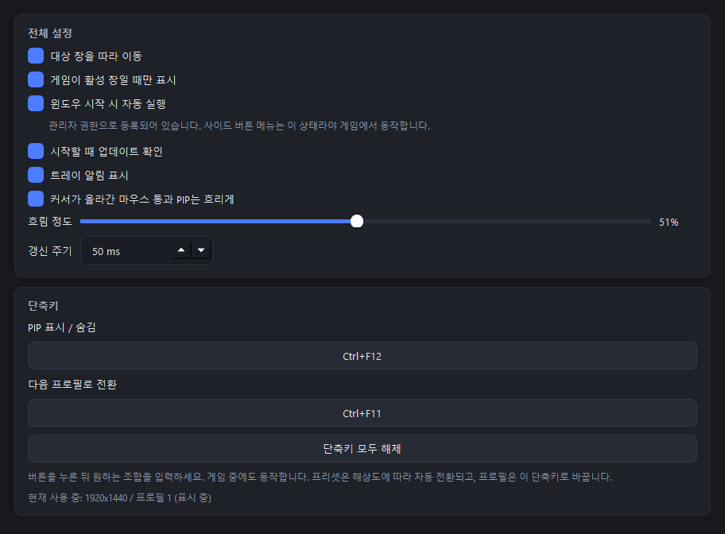

# TalesHelper

테일즈위버를 편하게 해주는 보조 도구입니다.

화면의 특정 영역을 잘라 항상 위에 띄우고(PIP), 게임 화면을 읽어 가려야 할 때는
알아서 비켜주며, 마우스 버튼 하나로 키 메뉴를 불러올 수 있습니다.

## 주요 기능

- **영역 크롭 PIP** — 게임 화면의 원하는 영역을 드래그로 지정해 별도 창으로 표시
- **해상도 프리셋 (4개)** — 크롭 좌표는 해상도마다 달라지므로, 해상도별로 영역 세트를 분리해 관리
  - 게임 해상도가 바뀌면 일치하는 프리셋으로 **자동 전환**
  - 등록되지 않은 해상도면 비어 있는 프리셋으로 전환해 새로 구성
- **프로필** — 한 프리셋 안에서 PIP 세트를 여러 개로 나누어 캐릭터마다 다른 구성 사용
  - 단축키 한 번으로 다음 프로필로 전환, 마지막으로 쓴 프로필을 기억
- **마우스 버튼 메뉴** — 휠 클릭을 누르고 있으면 8방향 키 고리
  - 짧게 누르면 원래 동작 그대로, 또는 지정한 키로 대체
- **버튼별 키** — 사이드 버튼 앞으로 / 뒤로에 키 하나씩 할당
- **키보드가 직접 치게 하기** — QMK · Vial 키보드에 수신기를 구우면, 위 두
  기능이 보내는 키를 프로그램 대신 키보드가 칩니다 (선택)
- **화면 감지** — 게임 화면을 읽어 PIP를 띄울 상황인지 판단
  - 캐릭터가 접속하기 전에는 띄우지 않고, 선택창으로 나가면 다시 숨김
  - 오픈마켓·아이템샵 등 36가지 창을 열면 자동으로 비켜줌
- **전역 단축키** — PIP 전체 표시/숨김 (게임 창이 포커스를 잡고 있어도 동작, 조합 직접 지정)
- **마우스 통과** — PIP를 클릭해도 아래 게임이 눌리도록 설정 가능
- **반투명 / 위치 / 크기** — PIP별로 개별 설정, 수치 입력도 지원
- **대상 창 추적** — 게임 창을 옮기면 PIP도 함께 이동
- **활성 창 연동** — 게임이 활성 창이 아닐 때 자동 숨김
- **트레이 상주** — 게임이 꺼지면 PIP만 숨기고 대기, 다시 켜지면 마지막 상태로 복원

## 동작 방식

화면 캡처가 아니라 **DWM 썸네일 API**(`DwmRegisterThumbnail`)를 사용합니다.
Windows가 대상 창의 렌더링 결과를 직접 합성해주므로:

- DirectX로 그리는 게임 화면도 정확히 표시됩니다
- 다른 창이 게임을 가려도 영향이 없습니다
- PIP가 자기 자신을 다시 비추는 무한 반복이 발생하지 않습니다

## 요구 사항

- Windows 10 / 11
- 테일즈위버 클라이언트 (`InphaseNXD.exe`)
- 소스로 실행할 경우 Python 3.10 이상

## 설치

[Releases](https://github.com/kimdonggeol/TalesHelper/releases)에서 `TalesHelper.exe`를 받아
원하는 폴더에 두고 실행하세요. 설치 과정은 없습니다.

설정이 exe 옆의 `config.json`에 저장되므로 쓰기 가능한 폴더에 두세요.

소스로 실행하려면:

```bash
pip install -r requirements.txt
python tales_helper.py
```

화면 감지에만 `numpy` 와 `opencv-python` 이 쓰입니다.
없어도 나머지 기능은 그대로 동작하고, 자동 숨김만 비활성화됩니다.

## 사용법

### 1. 실행

실행하면 창이 뜨지 않고 트레이에 상주합니다. **트레이 아이콘을 더블클릭**하면 설정 창이 열립니다.

테일즈위버는 따로 지정할 필요 없이 자동으로 찾습니다.
게임이 아직 꺼져 있으면 `테일즈위버 실행 대기 중`으로 표시되고, 게임을 켜면 자동으로 연결됩니다.

설정 창 왼쪽에는 **PIP / 마우스 / 일반** 세 갈래가 있습니다.
아래 2~7번은 **PIP**, 8번은 **마우스**, 9번은 **일반** 안에 있습니다.

### 2. 영역 추가


게임을 원하는 해상도로 켠 뒤, 좌측 **이 프로필의 PIP** 카드에서 **추가**를 누릅니다.
게임 화면 위로 선택 창이 덮이면서 파란 테두리와 `영역 추가 중` 안내가 표시됩니다.
원하는 부분을 **드래그**하면 그 자리에 PIP가 생성되고, 잠깐 깜빡여 위치를 알려줍니다.

생성된 PIP는 **드래그해서 이동**, **테두리를 잡아 크기 조절**할 수 있습니다.
PIP를 **우클릭**하면 영역 추가·수정·삭제와 마우스 통과를 바로 켜고 끌 수 있습니다.

### 3. 퀵슬롯은 클릭 한 번으로


게임의 `F1` ~ `F12` 퀵슬롯은 드래그할 필요 없이 버튼만 누르면 됩니다.
슬롯 바는 화면 좌측 하단에 고정된 크기로 붙어 있어서, 칸 위치를 해상도에서 바로 계산합니다.

추가된 PIP는 **원본의 2배 크기(52x52)** 로, 화면 정중앙에서 오른쪽 60px 위치에 생성됩니다.
그대로 원하는 자리로 끌어다 놓으면 됩니다.

### 4. PIP 하나씩 다듬기


좌측 목록에서 PIP를 고르면 우측에 그 PIP의 설정이 나옵니다.

| 항목 | 설명 |
|---|---|
| **미리보기** | 선택한 영역이 실시간으로 표시됩니다 (게임 실행 중일 때) |
| **캡처 영역** | `영역 다시 지정`으로 새로 드래그하거나, 게임 화면 기준 픽셀 좌표를 직접 입력합니다 |
| **위치 및 크기** | 좌표는 **게임 화면 좌측 상단이 (0,0)** 기준입니다. **배율** 버튼은 원본 대비 100 / 150 / 200 / 300% 크기로 맞춥니다 |
| **반투명** | 이 PIP만 투명하게 만듭니다 |
| **마우스 통과** | 켜면 PIP를 클릭해도 아래 게임이 눌립니다. 대신 그 PIP는 우클릭할 수 없으니, 해제는 설정 창이나 트레이에서 하세요 |

### 5. 해상도가 여러 개라면

크롭 좌표는 **해상도마다 달라집니다.** 게임 UI가 해상도에 정비례해 움직이지 않기 때문에,
1920x1200에서 잡은 영역은 1280x720에서 엉뚱한 곳을 가리킵니다.

그래서 **프리셋 = 해상도 프로필**입니다.

1. 해상도 A로 게임을 켜고 프리셋 1에 영역들을 추가합니다 (이때 해상도가 자동 기록됩니다)
2. 해상도 B로 바꾸면 비어 있는 프리셋 2로 자동 전환됩니다
3. 프리셋 2에 영역들을 추가합니다

이후에는 **해상도만 바꾸면 프리셋이 알아서 전환**됩니다. 수동으로 고를 일이 없습니다.

### 6. 캐릭터가 여러 명이라면

해상도는 같은데 캐릭터마다 보고 싶은 것이 다를 수 있습니다.
그럴 때 프리셋을 더 쓰지 말고 **프로필**을 나누세요.

1. 좌측 **프로필 (캐릭터별)** 카드에서 **새 프로필** 또는 **현재 복제**를 누릅니다
2. 이름을 캐릭터명으로 바꾸고 그 프로필에 PIP를 구성합니다
3. 게임에서 캐릭터를 바꿔 접속하면 `Ctrl+F11` 로 프로필만 넘깁니다

프로필은 게임 화면을 읽어 자동으로 바뀔 수는 없습니다.
대신 **마지막으로 쓴 프로필을 프리셋별로 기억**하므로,
해상도를 오가더라도 돌아오면 쓰던 구성이 그대로 나옵니다.
트레이 아이콘 우클릭 → **프로필**에서 골라도 됩니다.

프로필을 삭제하면 **그 프로필의 PIP도 함께 사라집니다.**

### 7. 화면을 보고 알아서 숨기기

TalesHelper는 게임 화면을 주기적으로 읽어 PIP를 띄워도 되는 상황인지 판단합니다.
설정할 것은 없습니다. 알아서 동작합니다.

**캐릭터가 접속하기 전에는 PIP가 뜨지 않습니다.**
로그인 화면과 캐릭터 선택창에는 가려줄 게임 화면이 없기 때문입니다.
접속하면 나타나고, 다시 캐릭터 선택창으로 나가면 숨습니다.

오픈마켓, 아이템샵, 옵션창처럼 화면을 크게 차지하는 창 **36가지**가 등록되어
있습니다. 그 창을 열면 PIP가 비켜주고 닫으면 돌아옵니다.

**창이 열리면 0.1초 안에 숨습니다.** 각 창이 어느 자리에 열리는지가
프로그램에 들어 있어서 찾아다닐 필요가 없기 때문입니다. 게임은 창을
화면 가운데에 여는데, 그 위치는 해상도가 바뀌어도 같은 규칙을 따릅니다.
창을 드래그해 옮겨도 따라가고, 모르는 자리에서 열리면 찾아낸 뒤
그 자리를 기억합니다.

게임 창에서 직접 읽기 때문에 PIP나 다른 창이 그 위를 덮고 있어도 상관없습니다.
다만 **전체화면 독점 모드에서는 동작하지 않습니다.** 창모드로 사용하세요.

내 환경에서 오판정이 생긴다면 `config.json` 의 `auto_hide` 안에 있는
`"enabled": true` 를 `false` 로 바꾸고 다시 실행하면 PIP가 항상 표시됩니다.

### 8. 사이드 버튼 메뉴

마우스 버튼을 **누르고 있으면** 커서 둘레에 키 고리가 나타납니다.
사이드 버튼 1(뒤로), 사이드 버튼 2(앞으로), 휠 클릭 중에서 고를 수 있습니다.
방향으로 밀고 버튼을 뗎면 그 키가 게임에 전달되고, 가운데는 취소입니다.
**짧게 누르면** 원래 버튼 동작 그대로입니다. 아래 `짧게 눌렀을 때` 에서
다른 키로 바꿀 수 있습니다.

게임 창을 쓰는 동안에만 버튼을 가져옵니다. 브라우저에서는 뒤로가기가
그대로 동작합니다.

#### 관리자 권한이 필요합니다

게임이 관리자 권한으로 실행되기 때문입니다. 윈도우는 낮은 권한 프로그램이
높은 권한 창에서 버튼을 가로채거나 키를 보내는 것을 막습니다.

`관리자로 실행.bat` 을 더블클릭하면 됩니다. `TalesHelper.exe` 와 같은 폴더에
두세요. 소스로 쓰는 경우에는 옆의 `tales_helper.py` 를 먼저 띄우므로, 고친 내용이
바로 반영됩니다. 매번 그렇게 쓰고 싶다면, 관리자 권한으로 실행한 상태에서
**일반** 탭의 `윈도우 시작 시 자동 실행` 을 켜세요. 그 상태에서 켜면 관리자
권한으로 등록되어, 다음 로그온부터는 UAC 창 없이 관리자로 뜹니다.

**나머지 기능은 관리자 권한 없이도 그대로 동작합니다.** 이 기능을 안 쓴다면
지금까지와 똑같이 그냥 실행하면 됩니다.

#### 키 지정

**마우스** 탭의 **사이드 버튼 메뉴** 카드에는 게임에서 뜨는 것과 같은 고리가
있습니다. 고칠 칸을 고리에서 누르고, 오른쪽에 보낼 키와 메뉴에 보일 이름을
적으면 됩니다. 조합키 없이 단일 키도 되고, `Del` 로 비웁니다. 빈 칸과 가운데는
아무것도 하지 않고 닫습니다. 이름을 비우면 키가 그대로 보입니다.

#### 버튼별 키

휠 클릭은 위의 고리가 쓰고, **사이드 버튼 앞으로 / 뒤로**는 키 하나씩
맡습니다. 누르면 바로 나가고, 그 버튼의 원래 동작은 돌려주지 않습니다.
비워 두면 그 버튼은 원래대로 동작합니다.

설정 창 → **마우스** → **버튼별 키** 카드에서 켜고, 버튼마다 키를 입력하면
됩니다. 테일즈위버 창을 쓰는 동안에만 바뀌고, 다른 프로그램에서는 원래
동작 그대로입니다.

#### 키보드가 직접 치게 하기 (선택)

QMK · Vial 키보드를 쓴다면, **사이드 버튼 메뉴와 버튼별 키가 보내는 키**를 이
프로그램이 보내는 대신 **키보드가 직접 치게** 할 수 있습니다. 두 기능이 같이
쓰는 하나짜리 설정입니다. 흉내가 아니라 실제로 그 키보드가 보내는
입력이라 손가락으로 친 것과 구분되지 않고, 조합키를 띄워 보내는 땜질도
필요 없어집니다. 펌웨어와 설명은 [`firmware/`](firmware/README.md) 에
있습니다. **기본으로 켜져 있고**, 키보드가 없거나 수신기가 없으면 알아서
원래 방식으로 보냅니다. 안 구워도 프로그램은 그대로 동작합니다.

---

버튼을 가져오는 것은 **커서가 게임 창 위에 있고 게임이 활성 창일 때뿐**입니다.
창모드로 옆에 브라우저를 띄워두고 그 위에서 눌렀다면 원래의 뒤로가기가
그대로 동작합니다.

고리는 **휠 클릭 고정**입니다. 메뉴가 뜨기까지의 시간은 같은 카드에서 정합니다.

#### 짧게 눌렀을 때

그 시간이 되기 전에 떼면 기본적으로는 **그 버튼의 원래 동작**이 그대로
나갑니다. `그 전에 떼면` 칸에 키를 걸면 그 키가 원래 동작을 **대신**합니다.
예를 들어 휠 클릭에 고리를 걸어 두고 이 칸에 `F3` 을 걸면, 꾹 누르면 고리가
뜨고 그냥 누르면 `F3` 이 나갑니다.

버튼을 가져오는 것은 게임 창을 쓰는 동안뿐이므로, **다른 프로그램에서는
원래 동작 그대로**입니다.

### 9. 전역 설정과 단축키

**일반** 탭에 있습니다.



| 설정 | 설명 |
|---|---|
| **대상 창을 따라 이동** | 게임 창을 옮기면 PIP도 같이 따라갑니다 |
| **게임이 활성 창일 때만 표시** | 다른 프로그램을 쓸 때 PIP를 자동으로 숨깁니다 |
| **윈도우 시작 시 자동 실행** | 로그온할 때 자동으로 실행됩니다. 관리자 권한으로 실행 중일 때 켜면 관리자 권한으로 등록되고, 체크박스 아래에 어느 쪽으로 등록되었는지 적힙니다 |
| **커서가 올라간 마우스 통과 PIP는 흐리게** | 게임은 커서를 자기 화면에 직접 그리기 때문에 PIP에 가려 보이지 않습니다. 커서가 올라가면 그 PIP를 흐리게 만들어 아래 커서가 비쳐 보이게 합니다 |
| **갱신 주기** | 값이 작을수록 부드럽지만 그만큼 자원을 더 씁니다 |

**단축키**는 버튼을 누른 뒤 원하는 조합을 그대로 입력하면 등록됩니다.

| 단축키 | 기본값 | 동작 |
|---|---|---|
| PIP 표시 / 숨김 | `Ctrl+F12` | PIP 전체를 숨기고, 다시 누르면 나타납니다 |
| 다음 프로필로 전환 | `Ctrl+F11` | 현재 프리셋의 프로필을 순회합니다 |

둘 다 게임 창이 포커스를 잡고 있어도 동작합니다.

## 설정 파일

설정은 실행 파일과 같은 위치의 `config.json`에 저장됩니다.
개인 환경 정보가 들어가므로 저장소에는 포함되지 않습니다.

처음부터 다시 설정하려면 이 파일을 지우고 다시 실행하면 됩니다.

## exe 빌드

```bash
pip install pyinstaller
pyinstaller --noconfirm --onefile --windowed --name TalesHelper --icon assets/TalesHelper.ico --add-data "assets/triggers;assets/triggers" tales_helper.py
```

`--add-data` 는 기본 제공 자동 숨김 조건을 실행 파일에 넣습니다.
조건을 추가하려면 [assets/triggers](assets/triggers) 를 보세요.

`dist/TalesHelper.exe`가 생성됩니다.

## 라이선스

[MIT](LICENSE)
